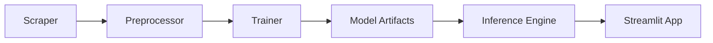

# System Architecture

## Overview
AniMate uses a linear data pipeline to scrape, process, and serve anime recommendations.

## Modules

### 1. Data Pipeline (`src/pipeline/`)
Responsible for data ingestion and model training.

- **Collector** (`collect.py`): Scrapes data from MyAnimeList.
- **Processor** (`process.py`): Cleans data, normalizes columns, and prepares features.
- **Trainer** (`train.py`): Trains the k-NN model and saves artifacts.

> [!TIP]
> See [Pipeline Instructions](src/pipeline/INSTRUCTIONS.md) for detailed usage.

### 2. Inference Engine (`src/inference/`)
Handles the recommendation logic during runtime.

- **Engine** (`engine.py`): Loads artifacts and performs vector similarity search.

### 3. User Interface (`app.py`)
Streamlit-based web interface for users to interact with the system.
